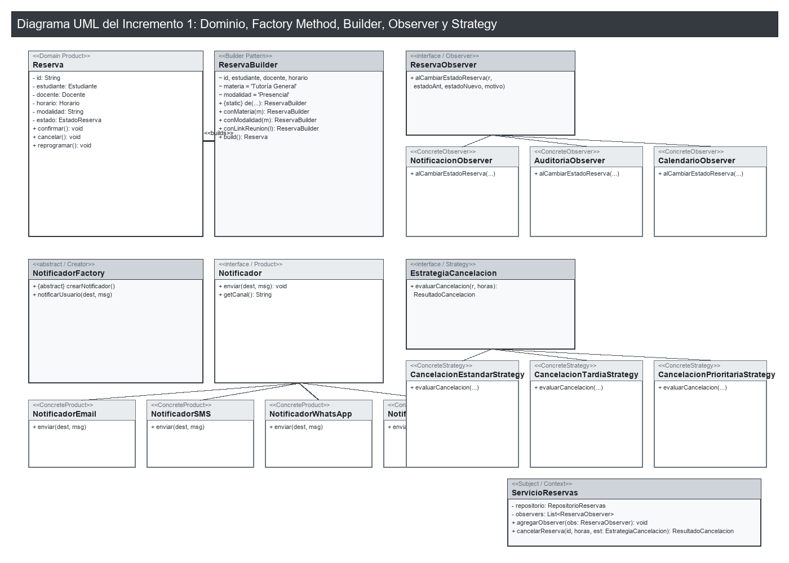

# Sistema de Gestión de Tutorías — Incremento 1 (Actividad Ae3)

**Repositorio GitHub:** [https://github.com/infamedtecnologia/sistema-tutorias](https://github.com/infamedtecnologia/sistema-tutorias)

Proyecto integrador para la actividad **Ae3 · Incremento 1 del proyecto integrador** (UCOM0310 · Diseño de Software · UEES). Evoluciona el diseño de las actividades Ae1 y Ae2 incorporando los patrones creacionales y del comportamiento de la Semana 4 (**Factory Method**, **Builder**, **Observer** y **Strategy**).

---

## 1. Propósito y Alcance del Incremento 1

El Incremento 1 del Sistema de gestión de tutorías evoluciona el modelo del dominio resolviendo problemas reales de arquitectura y comunicación:
1. **Recuperación de Ae1 y Ae2**: Se mantiene la jerarquía de entidades (`Usuario`, `Estudiante`, `Docente`, `Horario`, `Reserva`) y los patrones **Factory Method** (canales de notificación) y **Builder** (construcción fluida de reservas con validaciones).
2. **Integración del Patrón Observer (Semana 4)**: Permite que ante cualquier cambio de estado en una `Reserva` (confirmación, cancelación, reprogramación), múltiples componentes desacoplados reaccionen automáticamente (enviar notificaciones, registrar auditoría en bitácora y actualizar la agenda del docente).
3. **Integración del Patrón Strategy (Semana 4)**: Permite evaluar dinámicamente las políticas de cancelación de tutorías (`CancelacionEstandarStrategy`, `CancelacionTardiaStrategy`, `CancelacionPrioritariaStrategy`) calculando retenciones o penalizaciones según la anticipación del evento.

---

## 2. Justificación de los Patrones Utilizados

| Elemento | Patrón 1: Observer | Patrón 2: Strategy |
|---|---|---|
| **Problema real** | Al cambiar el estado de una reserva, se requería invocar manualmente múltiples servicios no relacionados. | Las reglas y sanciones por cancelación de tutorías variaban con condicionales rígidos según el tipo de tutoría y tiempo de anticipación. |
| **Contexto** | Reacción ante eventos del ciclo de vida de `Reserva`. | Procesamiento de cancelaciones en `ServicioReservas`. |
| **Qué cambia** | Las acciones secundarias ante un cambio de estado (notificación, auditoría, agenda). | Las reglas de cálculo y sanciones de cancelación. |
| **Qué permanece estable** | El dominio de `Reserva` y la orquestación principal del servicio. | La estructura general de cancelación y liberación de horarios. |
| **Patrón seleccionado** | **Observer (Comportamental)** | **Strategy (Comportamental)** |
| **Clases implicadas** | `ReservaObserver`, `NotificacionObserver`, `AuditoriaObserver`, `CalendarioObserver`, `ServicioReservas`. | `EstrategiaCancelacion`, `ResultadoCancelacion`, `CancelacionEstandarStrategy`, `CancelacionTardiaStrategy`, `CancelacionPrioritariaStrategy`. |
| **Principio SOLID** | Single Responsibility Principle (SRP) y Open/Closed Principle (OCP). | Open/Closed Principle (OCP) y Dependency Inversion Principle (DIP). |
| **Beneficio esperado** | Desacoplamiento total entre el sujeto (`ServicioReservas`) y los receptores de eventos. | Facilidad para añadir nuevas reglas de cancelación sin tocar el servicio. |
| **Costo / compromiso** | Notificaciones asíncronas requieren gestionar el orden de ejecución de observadores. | El cliente debe pasar la estrategia adecuada según el contexto. |
| **Verificación** | Pruebas unitarias en `ObserverTest` validando el disparo de eventos. | Pruebas unitarias en `StrategyTest` comprobando penalizaciones y bloqueos. |

---

## 3. Estructura del Repositorio y Paquetes

```
sistema-tutorias/
├── README.md
├── pom.xml
├── docs/
│   ├── uml-incremento1.puml
│   └── uml-incremento1.png
└── src/
    ├── main/java/edu/uees/tutorias/
    │   ├── Main.java
    │   ├── domain/
    │   │   ├── Usuario.java
    │   │   ├── Estudiante.java
    │   │   ├── Docente.java
    │   │   ├── Horario.java
    │   │   ├── EstadoHorario.java
    │   │   ├── EstadoReserva.java
    │   │   ├── Reserva.java
    │   │   └── ReservaBuilder.java  (Builder)
    │   ├── factory/                 (Factory Method)
    │   │   ├── Notificador.java
    │   │   ├── NotificadorEmail.java
    │   │   ├── NotificadorSMS.java
    │   │   ├── NotificadorWhatsApp.java
    │   │   ├── NotificadorTeams.java
    │   │   ├── NotificadorFactory.java
    │   │   └── creadores concretos...
    │   ├── observer/                (Observer)
    │   │   ├── ReservaObserver.java
    │   │   ├── NotificacionObserver.java
    │   │   ├── AuditoriaObserver.java
    │   │   └── CalendarioObserver.java
    │   ├── strategy/                (Strategy)
    │   │   ├── EstrategiaCancelacion.java
    │   │   ├── ResultadoCancelacion.java
    │   │   ├── CancelacionEstandarStrategy.java
    │   │   ├── CancelacionTardiaStrategy.java
    │   │   └── CancelacionPrioritariaStrategy.java
    │   ├── repository/
    │   │   ├── RepositorioReservas.java
    │   │   └── RepositorioReservasEnMemoria.java
    │   └── service/
    │       └── ServicioReservas.java
    └── test/java/edu/uees/tutorias/
        ├── domain/ReservaBuilderTest.java
        ├── factory/FactoryMethodTest.java
        ├── observer/ObserverTest.java
        ├── strategy/StrategyTest.java
        └── service/ServicioReservasTest.java
```

---

## 4. Diagrama UML de Clases (Incremento 1)

El diagrama completo se encuentra en la carpeta `docs/`:
- **Fuente PlantUML:** [`docs/uml-incremento1.puml`](docs/uml-incremento1.puml)
- **Imagen PNG (Grayscale):** [`docs/uml-incremento1.png`](docs/uml-incremento1.png)



---

## 5. Guía de Compilación y Ejecución (Maven)

### Compilar el proyecto:
```bash
mvn clean compile
```

### Ejecutar las pruebas unitarias automatizadas (JUnit 5):
```bash
mvn clean test
```

### Ejecutar la clase principal de demostración:
```bash
mvn exec:java
```

---

## 6. Declaración de Uso de Inteligencia Artificial

Durante el desarrollo de esta actividad utilicé herramientas de inteligencia artificial. Las utilicé para: organizar la estructura de diagramas UML PlantUML del Incremento 1, revisar la consistencia de las pruebas unitarias JUnit 5 y redactar las justificaciones técnicas en el informe y README. Verifiqué, probé y adapté el código Java y las decisiones de diseño presentadas.
